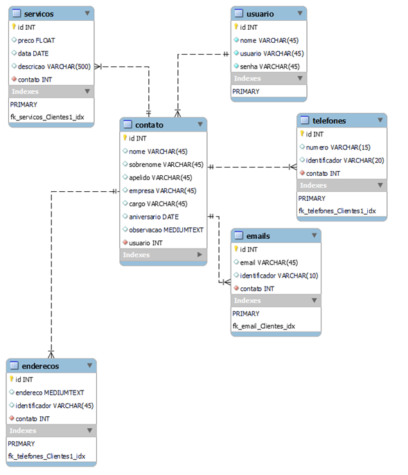
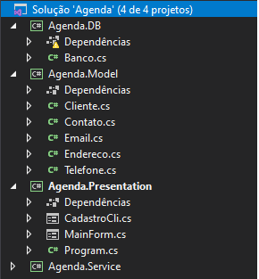

# agenda_cmu
 Projeto de agenda simples em C# com integração em banco de dados mysql.

# DOCUMENTAÇÃO PROJETO CMU - AGENDA
Wander Bassi pereira

1. Banco de dados: 
	A escolha do banco de dados utilizado no projeto foi o MYSQL.
	
	- A tabela serviços foi adicionada com o propósito de permitir com que o usuário possua os serviços realizados para cada contato.
	- A tabela usuário foi inserida com o objetivo de permitir com que diversos usuários tenham agendas independentes, utilizando um sistema de validação por login e senha. 

2. Linguagem de programação e arquitetura:
	- A linguagem utilizada para desenvolver o projeto foi o C#, utilizando Windows forms como front end.
	
3. A escolha de organização e modularização do código segue abaixo:
	- Agenda.DB – Encarregada de iniciar a conexão com o banco de dados e executar todas as ações de adição, consulta, edição e exclusão dos contatos (Com os respectivos e-mails, telefones, endereços e serviços. Atendendo as orientações do projeto, os e-mails, telefones e endereços não estão limitados e possuem Tag’s)
	- Agenda.Model – Encarregada de criar a estrutura de recebimento e colhimento de dados, bem como os devidos encapsulamentos. 
	- Agenda.Presentation- Possui todos as telas utilizadas na iteração com o usuário. A utilização do frontend modularizado e independente foi pensado para que seja possível com o menor esforço possível, descartar o tecnologia front end utilizada e aplicar uma nova, com o menor retrabalho. 
	- Agenda.Service – Embora não tenha sido muito utilizada, a classe Agenda.Service foi pensada para abrigar todas as regras de negócio e ser a ponte que une front-back;

OBS: DBAgenda = Arquivo do banco de dados;
